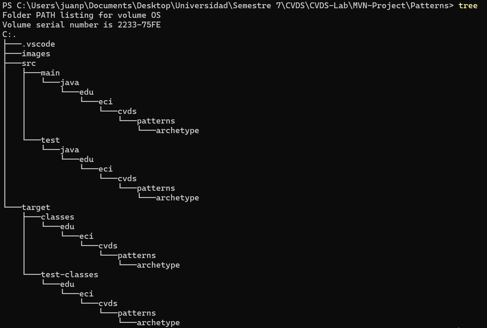
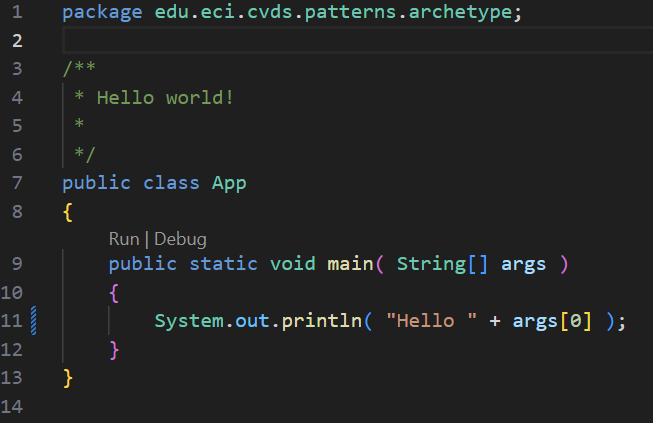
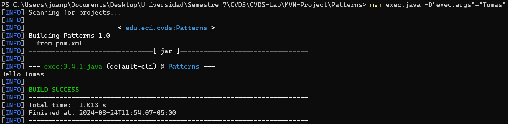
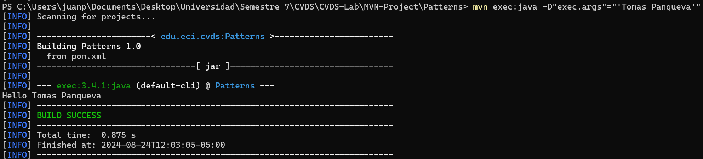
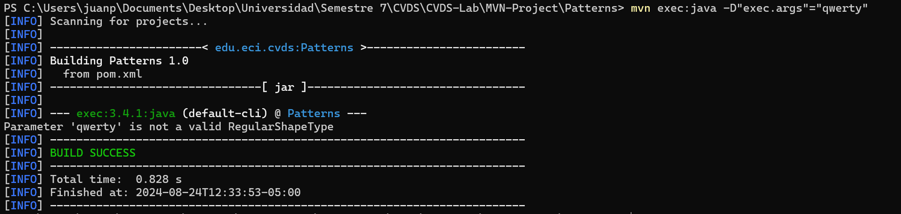
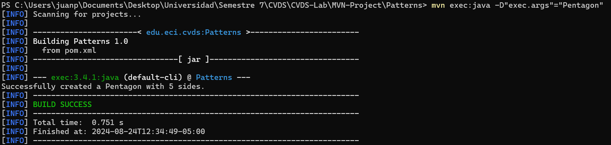

### Integrantes: Juan Pablo Camargo, Tomas Felipe Panqueva

### comando tree del proyecto

## Pasar parametros al exec de Maven

Lo probamos

## Treatando de enviar nombre y apellido

Solo tomo los caracteres antes del espacio

## Parametros de manera 'Compuesta'

## Probando Factory

- Sin parametros:

- Parametro "qwerty":

- Parametro Pentagon:

- Parametro Hexagon:

