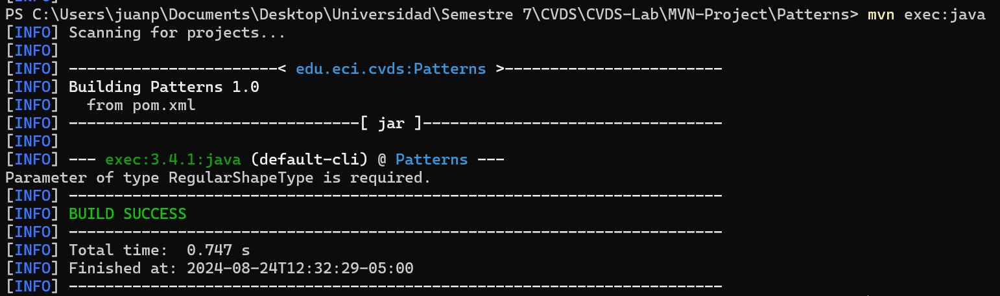

### Integrantes: Juan Pablo Camargo, Tomas Felipe Panqueva

### comando tree del proyecto

## Pasar parametros al exec de Maven

Lo probamos

## Treatando de enviar nombre y apellido

Solo tomo los caracteres antes del espacio

## Parametros de manera 'Compuesta'

## Probando Simple Factory

Usamos simple factory, debido que es mejor cuando buscas simplicidad en la creación de objetos, ya que centraliza la lógica de instanciación en un solo lugar, lo que reduce la duplicación de código y facilita el mantenimiento en proyectos pequeños o con pocas variantes de objetos.

- Sin parametros:

- Parametro "qwerty":

- Parametro Pentagon:

- Parametro Hexagon:

#### ¿Cuál(es) de las anteriores instrucciones se ejecutan y funcionan correctamente y por qué?
Todas se ejecutaron, el parametro "qwerty" y sin parametro fueron los unicos que no se ejecutaron correctamente debido a que no se encuentran en la enumeracion, los que se ejecutaron correctamente fue debido a que se encontraban en la enumeracion.